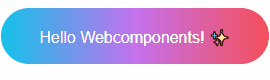

# :tada: Hello webcomponents
> I created this project to learn how to create javascript webcomponents.  

## Table of contents
* [Apresentation](#apresentation)
* [Technologies](#technologies)
* [Setup](#setup)
* [API](#api)

## Apresentation

## Technologies
* WebComponents

## Setup
Just open index.html in your browser to see this button

## API

| Name  |  Description  |
| ------------------- | ------------------- |
|  title |  the description of the button |
